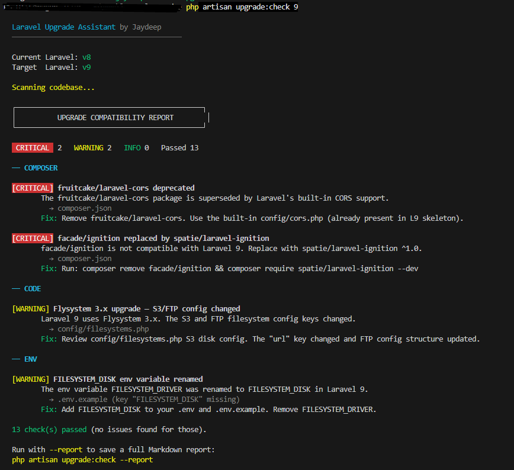
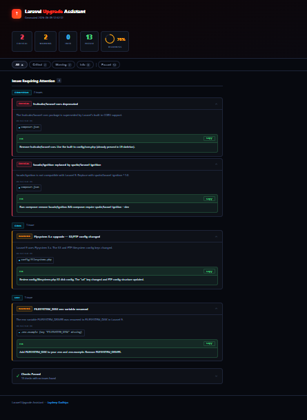

# Laravel Preflight

[](https://packagist.org/packages/jaydeep/laravel-preflight)
[](https://packagist.org/packages/jaydeep/laravel-preflight)
[](https://php.net)
[](https://laravel.com)
[](LICENSE)

> **The fastest way to find every breaking change before you upgrade Laravel.**

One Artisan command scans your entire codebase and reports only the upgrade issues that **actually exist in your project** — across PHP files, `composer.json`, config files, and `.env`. Supports upgrading from **Laravel 8 through 13** with 70+ checks covering every major breaking change.

---

## Why Laravel Preflight?

The official Laravel upgrade guide lists every possible breaking change — but most of them won't affect your app. Reading through the full guide, manually searching your code, and checking config keys wastes hours.

**This tool does it in seconds:**

- **Zero false positives** — only flags issues found in your actual code
- **Multi-version support** — checking Laravel 8 → 13 covers all 5 intermediate upgrade paths in one run
- **Actionable fixes** — every issue includes the exact fix command or change needed
- **No code modifications** — read-only scan, safe to run any time
- **CI/CD ready** — exits with code `1` when blocking issues exist, `0` when clean

---

## Installation

```bash
composer require jaydeep/laravel-preflight
```

Auto-discovered. No service provider registration needed.

---

## Quick Start

```bash
# Scan for breaking changes before upgrading to Laravel 13
php artisan upgrade:check 13

# Scan for a specific target version
php artisan upgrade:check 11

# Generate a full HTML + Markdown report
php artisan upgrade:check 13 --report
```

The command auto-detects your current Laravel version from `composer.json`. Multi-version upgrades are fully supported — scanning from Laravel 8 to 13 covers all intermediate breaking changes in a single run.

---

## Screenshots

### Console Output


### HTML Report


---

## How It Works

**1. Detect** — Reads your `composer.json` to determine the current Laravel version and the target you specify.

**2. Scan** — Runs four analyzers across your codebase:

| Analyzer | Scans | Checks |
|----------|-------|--------|
| **ComposerAnalyzer** | `composer.json` | Deprecated, removed, or replaced packages |
| **CodeAnalyzer** | `app/`, `routes/`, `config/`, `database/`, `resources/`, `tests/` | Regex pattern search across all `.php` files |
| **ConfigAnalyzer** | `config/*.php` | Missing or renamed config keys |
| **EnvAnalyzer** | `.env.example` / `.env` | New required environment variables |

**3. Report** — Prints a grouped, colour-coded console report. Use `--report` to also write `storage/upgrade-report.md` and `storage/upgrade-report.html`.

---

## Supported Upgrade Paths

| Target | From | Key Breaking Changes Checked |
|--------|------|------------------------------|
| **Laravel 9** | Laravel 8 | PHP 8.0 required, SwiftMailer removed, `fruitcake/laravel-cors` deprecated, `facade/ignition` replaced, `$dates` property deprecated, Flysystem 3.x, `dispatch_now()` removed, mail config `default` key |
| **Laravel 10** | Laravel 9 | PHP 8.1 required, `Bus::dispatchNow()` removed, `assertDeleted()` removed, `$dates` fully removed, Predis 2.x required, native return types enforced, `getQueueableRelations()` return type |
| **Laravel 11** | Laravel 10 | PHP 8.2 required, slim skeleton (`Http/Kernel.php` removed, `Console/Kernel.php` removed), service providers consolidated, `routes/api.php` not auto-loaded, `routes/channels.php` not auto-loaded, Carbon 3.x |
| **Laravel 12** | Laravel 11 | `doctrine/dbal` dropped, `Model::reguard()` removed, `Response::json()` throws on invalid JSON, `Collection::groupBy()` key preservation, `whereRelation()` signature, `Str::password()` removed, `spatie/laravel-ignition` ^2.0 |
| **Laravel 13** | Laravel 12 | `VerifyCsrfToken` → `PreventRequestForgery`, cache `serializable_classes`, `DB::upsert()` validation, cache key prefix format, polymorphic pivot names, `JobAttempted` event property, `array_first()`/`array_last()` conflicts |

---

## Example Output

```
  Laravel Preflight  by Jaydeep
  ─────────────────────────────────────────

  Current Laravel: v8
  Target  Laravel: v13

  Scanning codebase...

  ┌─────────────────────────────────────────────┐
  │          UPGRADE COMPATIBILITY REPORT        │
  └─────────────────────────────────────────────┘

   CRITICAL  7   WARNING 8   INFO 5   Passed 54

  ── COMPOSER

  [CRITICAL] fruitcake/laravel-cors deprecated
         The fruitcake/laravel-cors package is superseded by Laravel's built-in CORS support.
           → composer.json
         Fix: Remove fruitcake/laravel-cors. Use the built-in config/cors.php.

  ── CODE

  [WARNING] Model $dates property deprecated
         The $dates property on Eloquent models is deprecated in L9, removed in L10.
           → app/Models/Post.php
         Fix: Replace protected $dates = [...] with protected $casts = ['field' => 'datetime'].

  ── MIDDLEWARE

  [CRITICAL] VerifyCsrfToken renamed to PreventRequestForgery
         The CSRF middleware class was renamed and now includes request-origin verification.
           → app/Http/Kernel.php
         Fix: Replace VerifyCsrfToken::class with PreventRequestForgery::class.

  54 check(s) passed (no issues found for those).

  Run with --report to save a full Markdown + HTML report:
  php artisan upgrade:check --report
```

---

## Report Files

Add `--report` to generate both a Markdown and a self-contained HTML report:

```bash
php artisan upgrade:check 13 --report
```

| File | Description |
|------|-------------|
| `storage/upgrade-report.md` | Markdown — commit to your repo or share in a PR |
| `storage/upgrade-report.html` | Interactive HTML — severity filters, collapsible cards, one-click copy for fix commands, animated readiness score |

---

## Severity Levels

| Level | Meaning |
|-------|---------|
| `CRITICAL` | Will break your application — must fix before upgrading |
| `WARNING` | Likely to cause bugs or unexpected behaviour — review required |
| `INFO` | Behavioural change to be aware of — may or may not affect your app |

---

## CI / CD Integration

The command exits with code `1` when any issues are detected, and `0` when the codebase is clean — making it easy to gate deployments or upgrade PRs in any CI pipeline.

```yaml
# GitHub Actions example
- name: Check Laravel upgrade compatibility
  run: php artisan upgrade:check 13
```

```bash
# Fail a build if not ready to upgrade
php artisan upgrade:check 13 || exit 1
```

---

## Extending: Adding a New Laravel Version

1. Create `src/VersionRegistry/Laravel{N}Upgrade.php` extending `BaseUpgrade`
2. Implement `getBreakingChanges()` returning an array of `BreakingChange` objects
3. Register it in `VersionRegistry::$upgrades` and bump `$latestVersion`

Each breaking change supports four detection strategies:

| Property | Detected By | Example |
|----------|-------------|---------|
| `$searchPattern` | `CodeAnalyzer` — regex over PHP files | `'/VerifyCsrfToken/'` |
| `$composerPackage` | `ComposerAnalyzer` — checks `composer.json` | `'facade/ignition'` |
| `$configKey` | `ConfigAnalyzer` — checks `config/{file}.php` | `'cache.serializable_classes'` |
| `$envKey` | `EnvAnalyzer` — checks `.env.example` | `'CACHE_PREFIX'` |

```php
// Example: adding a breaking change
$this->change(
    'VerifyCsrfToken renamed to PreventRequestForgery',    // title
    'The CSRF middleware class was renamed in Laravel 13.', // description
    'critical',                                             // severity
    'middleware',                                           // category
    'Replace VerifyCsrfToken::class with PreventRequestForgery::class.', // fix
    '/VerifyCsrfToken/'                                     // searchPattern
);
```

---

## Architecture

```
src/
├── UpgradeAssistantServiceProvider.php   Auto-discovered service provider
├── Commands/
│   └── UpgradeCheckCommand.php           php artisan upgrade:check
├── Analyzers/
│   ├── BaseAnalyzer.php
│   ├── ComposerAnalyzer.php              Scans composer.json
│   ├── CodeAnalyzer.php                  Regex scans PHP files
│   ├── ConfigAnalyzer.php                Checks config/ keys
│   └── EnvAnalyzer.php                   Checks .env.example keys
├── Data/
│   └── BreakingChange.php                Value object for a single issue
├── VersionRegistry/
│   ├── VersionRegistry.php               Maps version numbers to upgrade classes
│   ├── BaseUpgrade.php
│   ├── Laravel9Upgrade.php               L8 → L9 breaking changes
│   ├── Laravel10Upgrade.php              L9 → L10 breaking changes
│   ├── Laravel11Upgrade.php              L10 → L11 breaking changes
│   ├── Laravel12Upgrade.php              L11 → L12 breaking changes
│   └── Laravel13Upgrade.php              L12 → L13 breaking changes
└── Report/
    └── ReportGenerator.php               Console + Markdown + HTML report
```

---

## Requirements

| | Version |
|--|---------|
| **PHP** | `^7.4` \| `^8.0` |
| **Laravel** | `^8.0` through `^13.0` |

---

## FAQ

**Does it modify any files?**
No. The scan is entirely read-only. Nothing in your project is changed.

**Can I run it on a project that is already on a newer version?**
Yes — the command detects your current version and skips checks that don't apply. If you're already on the target version it exits immediately.

**How is it different from Rector or Laravel Shift?**
Rector and Shift *modify* your code. This tool only *reports* — it tells you what needs to change and where, so you can make the changes yourself with full control.

**Can I use it in a pre-upgrade CI check?**
Yes. It returns exit code `1` when issues are found. Add it to your CI pipeline to block merges until the codebase is compatible with the target version.

**What if a check fires but doesn't apply to my app?**
The results are informational. Review the listed file paths and decide whether the fix applies to your specific usage.

---

## Contributing

Contributions are welcome — especially new breaking change definitions for existing or future Laravel versions.

1. Fork the repository
2. Add your breaking changes to the relevant `Laravel{N}Upgrade.php` file
3. Test by running `php artisan upgrade:check` against a project that uses the pattern
4. Open a pull request with a brief description of the breaking change and a link to the official Laravel upgrade guide

---

## Related Packages

- [jaydeep/laravel-guarddog](https://github.com/JaydeepGadhiya/laravel-guarddog) — Laravel security scanner
- [jaydeep/laravel-xray](https://github.com/JaydeepGadhiya/laravel-xray) — Architecture visualization and dead code detection

---

## License

MIT — [Jaydeep Gadhiya](https://github.com/JaydeepGadhiya)
